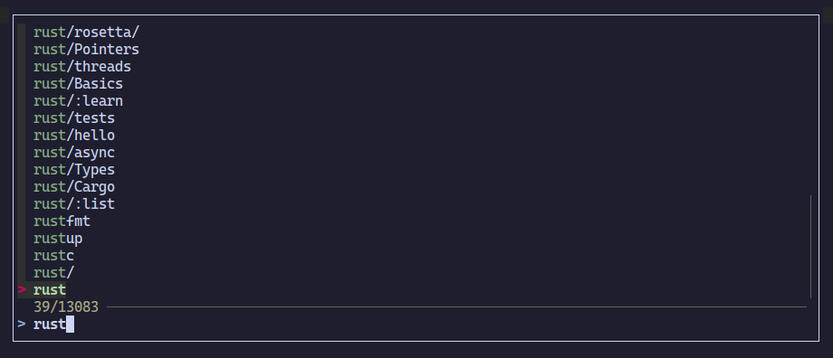
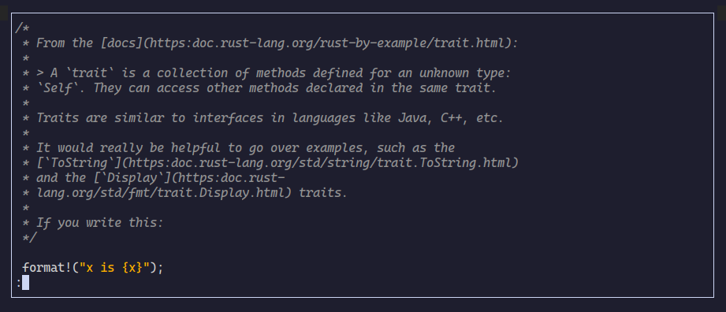

# Tmux cht.sh

Access cheatsheets easily in a popup in tmux!




## Requirements

- `curl`
- `tmux`
- `fzf`
- `bash`

## Installation

### Install using TPM

Put this in your configuration file,

```sh
set -g @plugin 'kenos1/tmux-cht-sh'
```

### Install manually using git

1. Clone the repository

```sh
git clone https://github.com/kenos1/tmux-cht-sh ~/clone/path
```

2. Put this line in your config

```sh
run-shell ~/clone/path/tmux-cht-sh.tmux
```

3. Restart `tmux`

## Usage

To invoke the cheatsheet use the keybind <kbd>prefix</kbd>–<kbd>S</kbd>

## Configuration

Change the pager by changing your `PAGER` environment variable. This means adding this to your shell config:

```sh
# Bash/ZSH example using less
export PAGER="less"
```
